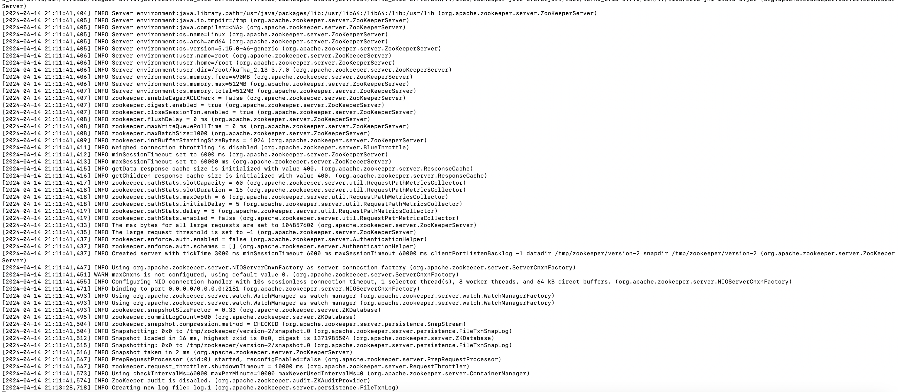
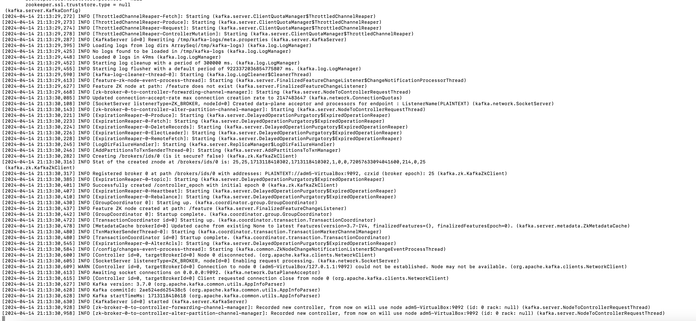
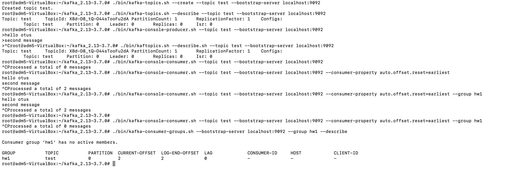

# Домашка "Знакомство с Apache Kafka. Основные компоненты, варианты развертывания, экосистема, сценарии использования "

1. Установить Java JDK
2. Скачать Kafka с сайта kafka.apache.org и развернуть на локальном диске
3. Запустить Zookeeper
4. Запустить Kafka Broker
5. Создать топик test
6. Записать несколько сообщений в топик
7. Прочитать сообщения из топика

